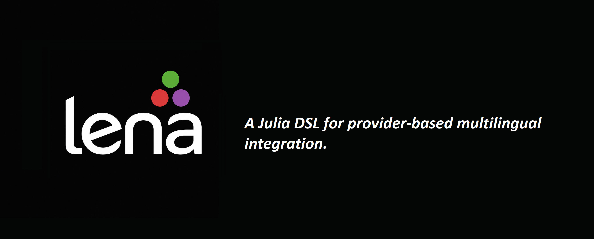

# Lena.jl



Lena.jl is an experimental Julia package for embedding, building, importing, and calling foreign-language code from Julia through a unified provider interface.

The goal is simple: write small pieces of Python, C, or Rust close to the Julia code that uses them, and call exported functions as ordinary Julia properties.

```julia
using Lena

py = @python """
def square(x):
    return x * x
"""

c = @c """
#include <stdint.h>

LENA_EXPORT int32_t add_i32(int32_t a, int32_t b) {
    return a + b;
}
"""

rs = @rust """
@export
fn mul_i32(a: i32, b: i32) -> i32 {
    a * b
}
"""

py.square(5)                    # 25
c.add_i32(Int32(10), Int32(20)) # 30
rs.mul_i32(Int32(6), Int32(7))  # 42
```

> Lena.jl is currently an MVP. The public API may change before the first stable release.

## Features

Current provider support:

- inline Python with `@python """..."""`;
- inline C with `@c """..."""`;
- inline Rust with `@rust """..."""`;
- C project loading with `Lena.C.load(path)`.

The core abstraction is a **provider**:

```text
Python code  -> Python provider -> py.function(...)
C code       -> C provider      -> c.function(...)
Rust code    -> Rust provider   -> rs.function(...)
C directory  -> C provider      -> native.function(...)
```

## Installation

Lena.jl is not registered yet. For local development, clone the repository and use Julia's package manager in development mode:

```julia
pkg> dev /path/to/Lena.jl
pkg> instantiate
pkg> test Lena
```

Or from the shell:

```bash
cd /path/to/Lena.jl
julia --project=. -e 'using Pkg; Pkg.instantiate(); Pkg.test()'
```

Do not load the package with `include("src/Lena.jl")`. Activate the project and use `using Lena`.

## Requirements

The Julia-only package can be loaded without building native code, but individual providers require external tools:

| Provider | Requirement |
| --- | --- |
| Python | PythonCall.jl and a working Python executable |
| C | a C compiler such as `cc`, `gcc`, or `clang` |
| Rust | Rust and Cargo |

PythonCall may create its own Python environment. To force it to use your system Python, start Julia like this:

```bash
JULIA_PYTHONCALL_EXE=$(which python3) julia --project=.
```

## Inline Python

```julia
using Lena

py = @python """
def greet(name):
    return f"Hello, {name}!"

def add(a, b):
    return a + b
"""

println(py.greet("Lena"))
println(py.add(2, 3))
```

`@python` executes the code in a Python namespace and returns a provider object. Functions and values defined in that namespace can be accessed as properties:

```julia
py.add(10, 20)
```

## Inline C

```julia
using Lena

c = @c """
#include <stdint.h>

LENA_EXPORT int32_t add_i32(int32_t a, int32_t b) {
    return a + b;
}

LENA_EXPORT double mul_f64(double a, double b) {
    return a * b;
}
"""

println(c.add_i32(Int32(10), Int32(20)))
println(c.mul_f64(2.5, 4.0))
```

Functions that should be visible to Julia must be marked with `LENA_EXPORT`.

The `@c` provider:

1. writes the C code into Lena's build cache;
2. compiles it into a shared library;
3. loads the library with `Libdl`;
4. resolves exported symbols;
5. wraps exported functions as Julia-callable properties.

## Inline Rust

```julia
using Lena

rs = @rust """
@export
fn add_i32(a: i32, b: i32) -> i32 {
    a + b
}

@export
fn mul_f64(a: f64, b: f64) -> f64 {
    a * b
}
"""

println(rs.add_i32(Int32(10), Int32(20)))
println(rs.mul_f64(2.0, 4.0))
```

The `@export` marker is Lena syntax. Lena.jl rewrites exported Rust functions into C ABI functions, builds a temporary `cdylib` with Cargo, and calls it through Julia's native `ccall` mechanism.

Supported Rust MVP types:

| Rust | Julia |
| --- | --- |
| `i8` | `Int8` |
| `i16` | `Int16` |
| `i32` | `Int32` |
| `i64` | `Int64` |
| `u8` | `UInt8` |
| `u16` | `UInt16` |
| `u32` | `UInt32` |
| `u64` | `UInt64` |
| `f32` | `Float32` |
| `f64` | `Float64` |
| `bool` | `Bool` |

The Rust provider currently supports only simple C-ABI-safe primitive function signatures. Types such as `String`, `Vec<T>`, `&str`, slices, structs, callbacks, and ownership-sensitive values are intentionally out of scope for the MVP.

## C project loading

Lena.jl can also load a small C project from a directory.

Expected layout:

```text
native_mylib/
├─ Lena.toml
├─ include/
│  └─ mylib.h
└─ src/
   └─ mylib.c
```

Example `Lena.toml`:

```toml
name = "mylib"
language = "c"
headers = ["include/mylib.h"]
sources = ["src/mylib.c"]
include_dirs = ["include"]
exports = ["add_i32", "mul_f64"]
```

Usage:

```julia
using Lena

mylib = Lena.C.load("examples/native_mylib")

println(mylib.add_i32(Int32(1), Int32(2)))
println(mylib.mul_f64(2.0, 4.0))
```

`import` is a Julia keyword, so the stable public spelling is currently `Lena.C.load(path)`. An explicit alias may exist as `Lena.C.import_project(path)` or `Lena.C.var"import"(path)`.

## Development

From the repository root:

```bash
julia --project=.
```

Then in Julia:

```julia
using Pkg
Pkg.instantiate()
Pkg.precompile()
Pkg.test()
```

To test with a specific Python executable:

```bash
JULIA_PYTHONCALL_EXE=$(which python3) julia --project=. -e 'using Pkg; Pkg.test()'
```

## Design

Lena.jl is built around provider objects. A provider owns the runtime/build information needed to call code from another language, while exposing exported functions through ordinary Julia property access:

```julia
provider.some_function(args...)
```

The native providers share the same lower-level idea:

```text
C/Rust source -> shared library -> Libdl.dlopen -> dlsym -> ccall
```

Python is different:

```text
Python source -> Python namespace -> PythonCall object -> Julia wrapper
```

Long-term, Lena.jl is intended to become a provider-oriented DSL for describing multilingual Julia applications.

## Current limitations

This package is experimental and intentionally conservative.

C limitations:

- supports simple exported functions and primitive signatures;
- does not fully understand arbitrary C headers;
- does not support C++ ABI;
- does not support full typedef/struct/callback/function-pointer modeling yet.

Rust limitations:

- supports simple `@export fn name(args...) -> ret { ... }` functions;
- supports only primitive C-ABI-safe types in the MVP;
- requires Cargo;
- does not support Rust-native ownership types across the Julia boundary yet.

Runtime limitations:

- foreign code runs on the user's machine;
- build artifacts are cached locally;
- compiler and platform behavior may differ across Linux, macOS, and Windows.

## Safety note

Lena.jl executes Python code and compiles/loads native C or Rust code. Only run code that you trust.

## License

This project is licensed under the terms of the license file in this repository.
